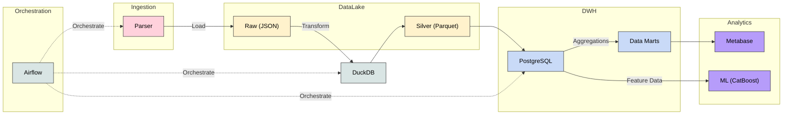

# 🏠 Moscow Flats Pipeline

Пайплайн для сбора, хранения и аналитики рынка недвижимости Москвы.
Обеспечивает полный цикл обработки данных: от парсинга объявлений до построения витрин и обучения ML-модели для оценки стоимости квадратного метра.

## 🛠️ Основной стек
* **Оркестрация:** AirFlow
* **Хранилище:** PostgreSQL (DWH), S3 (MinIO)
* **Compute:** DuckDB
* **Контейнеризация:** Docker, Docker Compose
* **BI:** MetaBase
* **ML:** CatBoost


## 🏗️ Архитектура данных
Используется Medallion Architecture

* Raw (S3): Сырые данные в `JSON` lines, поступающие напрямую от парсера без изменений

* Silver (S3): Данные в `Parquet`. Очищены, типизированы, дедуплицированы.

* Gold (PG): DWH с историчностью `SCD2`. Готовые витрины для `MetaBase`.

## Схема


## Pipeline
Пайплайн состоит из 5 ключевых этапов:
* Сбор через Playwright, запись в S3 с Hive-партиционированием.

* Трансформация JSON -> Parquet, очистка и дедубликация бизнес-логикой.

* Загрузка в DWH и применение SCD2 (отслеживание истории изменения цен).

* Обучение модели для оценки стоимости квадратного метра и сохранение модели в S3.

* Построение витрин. Агрегация витрин (статистика по районам/метро, выявление резкого снижения цен).

Каждый этап пайплайна снабжен проверками качества данных и алертами в Telegram.

## 🐍 Используемые библиотеки Python
* `logging`
* `datetime`, `pendulum`
* `json`
* `duckdb`
* `pandas`, `numpy`
* `playwright`, `bs4`
* `boto3`

## 🚀 Быстрый запуск
1. **Клонирование репозитория:**
    ```
    git clone https://github.com/Ilyasir/moscow-flats-pipeline.git
    ```
    ```
    cd moscow-flats-pipeline
    ```

2. **Настройка окружения:**
Скопируйте пример файла .env. Укажите необходимые переменные (пароли, ключи)
    ```
    cp .env.example .env
    ```

3. **Развертывание инфраструктуры:**
Убедитесь, что установлен и запущен Docker. Команда автоматически соберет все образы и поднимет контейнеры. Создаст коннекшены в Airflow и бакеты в Minio:
    ```
    make all
    ```

4. **Доступ к сервисам:**
После сборки и инициализации сервисы будут доступны по следующим адресам:
    - **Airflow**: http://localhost:8080
    - **MetaBase**: http://localhost:3000
    - **MinIO Console**: http://localhost:9001

5. **Запуск ETL-процессов**

    В интерфейсе Airflow включите все DAG. Проход пайплайна может занимать 30-40 минут, так как включает в себя полный цикл парсинга данных (обработка ~34 000 объектов), их очистку, типизацию и последующую загрузку в DWH. После завершения работы DAGов вы можете зарегистрироваться в MetaBase и приступить к созданию дашбордов.

## BI
Весь проект развернут на VPS (Ubuntu 24.04, 3 vCPU, 6GB RAM).
И я создал публичную ссылку на дашборд в MetaBase. Кликай:
📊 [Посмотреть дашборд](http://130.193.58.165:9987/public/dashboard/972a7998-b8f1-4fa5-887b-542198d06af8)
(сервер может быть временно выключен или недоступен (ради экономии ресурсов), если ссылка недоступна, скрины дашбордов представлены ниже)


## 📈 Roadmap развития
Проект можно улучшать:

* Перенос всей SQL-логики трансформаций в `dbt`

* Покрытие кода Unit-тестами на `Pytest`. И внедрение тестов в CI

* Сбор данных с нескольких площадок недвижимости (Авито, Домклик) с глобальной дедупликацией. Настроить улучшенный обход блокировок через прокси

* Парсинг дополнительных полей (тип дома, высота потолков, год постройки), это позволит улучшить точность ML-модели и построить новые интересные графики.

* Использование моделей из S3. Текущая реализация просто сохраняет веса моделей в S3. Планируется создание API (`FastAPI`) для обеспечения инференса модели.